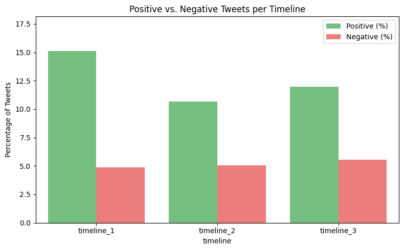
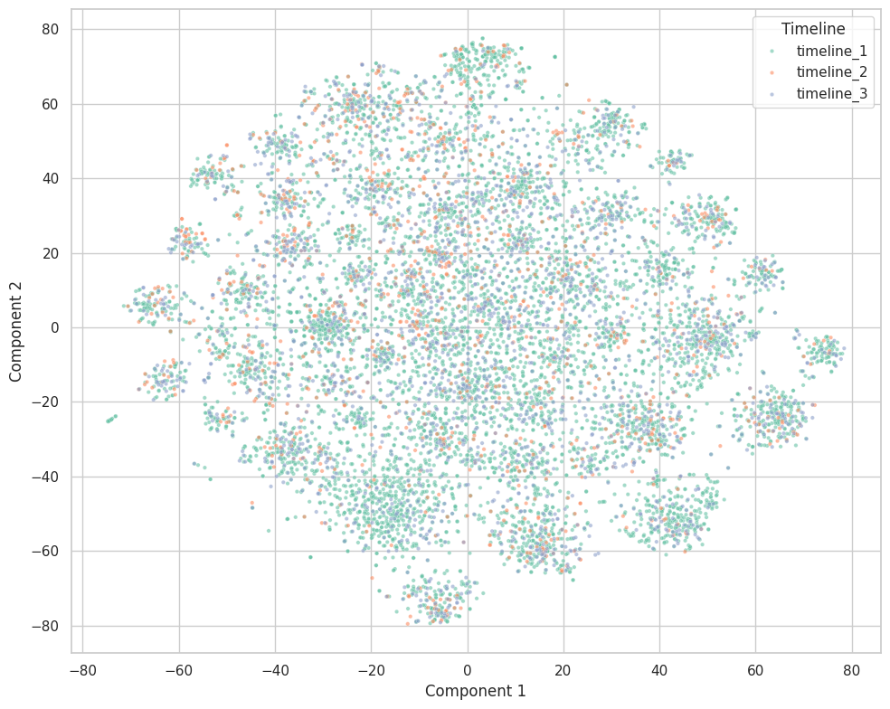

# Persian Twitter Sentiment & Content Shift Analysis

[](https://www.python.org/)
[](https://opensource.org/licenses/MIT)
[]()

This project began as a personal, small‑scale inquiry — not as a definitive survey
of Iranian public opinion. I wanted to look closely at a particular corner of the
Persian‑speaking online world and simply **see for myself** whether the tone of
people’s words had changed from one period to the next. I am acutely aware that
the data I worked with comes from a single curated Telegram channel and cannot speak
for the broader population of Iran; it reflects only a slice of the conversation,
shaped by the channel’s own selection and by the nature of the platform. Any
conclusions here are offered humbly, as one observer’s attempt to trace the
emotional texture of a community through the fragments it left behind.

My central question was straightforward: did the events surrounding Timeline 2
genuinely deepen people’s distress, and when Timeline 3 arrived — carrying with it
a hope of relief — did that hope translate into a measurable lift in spirits? The
data showed that the first answer was yes: sadness and national concerns became
more prominent in the second period. But the second answer was far more sobering.
The anticipated boost in positive sentiment never materialised; even after the
change, the community’s mood remained as heavy as it had been before. It seems that
the pain of the earlier period did not simply dissolve with the turning of a page,
and whatever expectations people held for Timeline 3 were not enough to restore the
lightness that had been lost.

I warmly invite others to **contribute, critique, and improve** this work. The
pipeline can be refined, the sentiment analysis can be strengthened with
transformer‑based models, and — most importantly — the dataset can be expanded to
include multiple channels, original X data, and broader demographics. If you have
ideas for more robust data sources or better NLP methods, please open an issue or
a pull request. Together we can build a more accurate picture of the emotional
currents that run through Persian social media.

---

## Table of Contents
- [Overview](#overview)
- [Data Collection](#data-collection)
- [Data Cleaning & Preprocessing](#data-cleaning--preprocessing)
- [Exploratory Data Analysis (EDA)](#exploratory-data-analysis-eda)
- [Sentiment Analysis](#sentiment-analysis)
- [Semantic Shift Analysis](#semantic-shift-analysis)
- [Key Findings](#key-findings)
- [Repository Structure](#repository-structure)
- [Dependencies](#dependencies)
- [Limitations](#limitations)
- [License](#license)

---

## Overview

**Research Question:**  
How did the sentiment and topic focus of the Persian‑speaking community on X (Twitter)
change before, during, and after a major national event?

**Hypothesis:**
1. **Timeline 1** (calm period) – mostly neutral, daily‑life oriented discourse.
2. **Timeline 2** (event period) – drop in positive sentiment, rise in anger/sadness,
   shift towards national and political topics.
3. **Timeline 3** (post‑event) – partial recovery of positivity, return to personal themes.

**Data source:**  
Public Telegram channel `sut_tw`.
Scraped via the public web preview (`t.me/s/sut_tw`), no API keys required.

**Time windows (UTC):**

| Timeline | Start | End |
|----------|-------|-----|
| Timeline 1 | 24 Jun 2025 | 28 Dec 2025 |
| Timeline 2 | 29 Dec 2025 | 28 Feb 2026 |
| Timeline 3 | 1 Mar 2026 | 16 May 2026 |

---

## Data Collection

The scraping script (`scraper.py`) uses **BeautifulSoup** to fetch
messages from the public Telegram preview. No API credentials are required.

- Retrieves **all messages** from the channel.
- Splits them into the three pre‑defined date bins.
- Saves each bin as a separate CSV file (`timeline_X.csv`) in `data/raw/`.

**Key details:**
- Messages are stored with `message_id`, `date`, and `text` (raw).
- The scraper includes pagination logic and a 1‑second delay to respect rate limits.
- If a VPN/proxy is needed, it can be configured via the `PROXY` variable.

---

## Data Cleaning & Preprocessing

A multi‑step cleaning pipeline was applied using **Shekar** (Persian NLP toolkit)
and custom regex rules. The full notebook is `notebooks/cleaning.ipynb`.

**Steps performed:**

1. **Extract tweet text** – removed the channel’s watermark (`@sut_tw`) and the
   original writer’s attribution line (e.g., `^username^`).
2. **Remove duplicates** – both by `message_id` and by identical cleaned text.
3. **Deep clean** – removed URLs, hashtags, emojis, @mentions, and extra whitespace.
4. **Language filtering** – kept only messages detected as Persian (using `langdetect`).
5. **Short message removal** – discarded tweets with fewer than 2 words.
6. **Persian word filtering** – after tokenisation, tokens not containing Persian
   characters were removed.
7. **Stemming** – applied Shekar’s stemmer (light suffix stripping).
8. **Stopword removal** – a comprehensive hand‑curated list of ~200 Persian stopwords
   was used, **but negative words** (e.g., `نه`, `بد`, `مشکل`) were kept for sentiment.
9. **Non‑Persian token removal** – tokens without any Persian Unicode character
   were dropped.

The resulting **clean text** was stored in the column `normalized`, while tokenised
and stemmed versions were saved as `tokens_persian` and `tokens_stemmed`.
The cleaned dataset (`all_cleaned.csv`) and processed dataset (`all_processed.csv`) were saved after
index resetting.

---

## Exploratory Data Analysis (EDA)

The EDA notebook (`notebooks/eda.ipynb`) produced:

### Top 10 Unigrams per Timeline

| Timeline 1 | Timeline 2 | Timeline 3 |
|-------------|-------------|-------------|
| زندگی (life) | زندگی (life) | زندگی (life) |
| بابا (dad) | ایران (Iran) | ایران (Iran) |
| مامان (mom) | آدم (person) | اینترنت (internet) |
| خانه (home) | درس (study) | فکر (thought) |
| دختر (daughter) | مرد (man) | مرد (man) |
| پسر (son) | فکر (thought) | خانه (home) |
| فکر (thought) | خرید (buying) | جنگ (war) |
| درس (study) | جنگ (war) | آدم (person) |
| مرد (man) | خانه (home) | بابا (dad) |
| آدم (person) | پول (money) | پسر (son) |

**Interpretation:**  
Timeline 1 is overwhelmingly domestic and family‑oriented.  
Timeline 2 introduces national identity (`ایران`), economic and war terms.
Timeline 3 adds `اینترنت` while keeping national and conflict terms,
mixing personal and collective topics.

### Bigrams (Top 5)

| Timeline 1 | Timeline 2 | Timeline 3 |
|-------------|-------------|-------------|
| هوش مصنوعی (AI) | هوش مصنوعی (AI) | مردم ایران (people of Iran) |
| یه دختر (a girl) | ناوگان عظیمی (massive fleet) | اینترنت وصل (internet connected) |
| دوست دارم (I like) | دوست داشتم (I liked) | یه دختر (a girl) |
| زنگ زد (called) | یه نفر (a person) | یه هفته (one week) |
| قرار نیست (isn’t supposed to) | یه عده (a group) | قطعی اینترنت (internet outage) |

**Interpretation:**  
The bigrams reinforce the shift from personal/tech topics to national, military,
and internet‑related issues.

### POS & NER on Top‑50 Words

POS distributions were obtained with Shekar’s ALBERT‑based ONNX tagger, run only
on sample sentences to avoid overheating.

- **NER (named entities)** showed a shift:  
  Timeline 1 → 61 % dates, 27 % locations, 9 % persons.  
  Timeline 2 → 39 % dates, 28 % locations, 22 % persons, 6 % events.  
  Timeline 3 → 51 % dates, 35 % locations, 6 % events.  

The rise in `PER` in Timeline 2 and the appearance of `EVE` indicate a move towards
discussing specific individuals and notable events.

---

## Sentiment Analysis

### Methodology
**BidNLP’s built‑in PersianSentimentAnalyzer** was adopted:
This rule‑based analyzer classifies each text into one of three categories: (`negative`), (`neutral`), or (`positive`).

### Results (percentage of total tweets)

| Timeline | Negative | Neutral | Positive |
|----------|----------|---------|----------|
| 1 | ~5 % | ~80 % | ~15 % |
| 2 | ~5 % | ~84 % | ~11 % |
| 3 | ~6 % | ~82 % | ~12 % |

### Statistical Significance
A **chi‑square test** on the contingency table (positive vs. not‑positive across
timelines) gave a p‑value ≪ 0.001, confirming that the proportion of positive tweets
varies by period.  
Pairwise **z‑tests with Bonferroni correction** (α = 0.0167) showed:
- **Timeline 1 → Timeline 2**: drop from 15 % to 11 % is **significant** (p < 0.0001).
- **Timeline 2 → Timeline 3**: increase from 11 % to 12 % is **not significant**
  (p = 0.26).
- **Timeline 1 → Timeline 3**: overall decline remains significant (p = 0.0001).

**Conclusion:**  
Positive sentiment truly decreased during the event and **did not recover** in the
following months; the slight rise in Timeline 3 is likely noise.



---

## Semantic Shift Analysis

### Vectorization & Visualization
Tweets were vectorized using **TF‑IDF** (word unigrams + bigrams, 5000 features)
to avoid torch/ONNX overhead.  
A **stratified sample** (1000 tweets per timeline) was reduced to 3D with
**t‑SNE** and plotted interactively with Plotly.

**Observation:**  
The 3D scatter plot showed **no clear separation** between timelines.  
K‑means clustering on the full data yielded extremely low silhouette scores
(~0.003), indicating that the overall language usage did not form distinct clusters.

### Interpretation
Although the **most frequent words** and **sentiment proportions** changed
significantly, the general vocabulary and syntax of the tweets remained similar
enough that TF‑IDF‑based dimensionality reduction could not cleanly separate the
periods. This suggests a **subtle but real shift** in topical focus rather than a
complete overhaul of writing style.



---

## Key Findings

1. **Topic shift**: The discourse moved from family and personal life to national
   identity, war, economy, and internet connectivity.
2. **Sentiment dip**: Positive sentiment dropped significantly in Timeline 2 and
   **failed to recover** in Timeline 3. The post‑event period did not bring the
   expected emotional rebound.
3. **Stable negativity**: Negative sentiment remained low and constant (≈5 %),
   meaning the decrease in positivity was absorbed by neutrality, not by increased
   overt negativity.
4. **Linguistic similarity**: Despite these shifts, the **overall word‑use patterns**
   (as measured by TF‑IDF) did not form visually distinct clusters, suggesting
   that the change was one of emphasis rather than of fundamental language.

---

## Repository Structure

```
├── data
│   ├── cleaned
│   ├── preprocessed
│   └── raw
├── LICENSE
├── notebooks
│   ├── classification.ipynb
│   ├── cleaning.ipynb
│   ├── eda.ipynb
│   ├── preprocessing.ipynb
│   └── sent_analysis.ipynb
├── notes.txt
├── README.md
├── reports
│   ├── charts
│   └── reports.md
├── requirements.txt
└── scraper.py
```

---

## Dependencies

- **Data scraping:** `beautifulsoup4`, `requests`
- **Persian NLP:** `shekar` (normalizer, tokenizer, stemmer, stopwords, POS, NER)
- **Sentiment:** `bidnlp` (PersianSentimentAnalyzer)
- **Vectorisation:** `scikit-learn` (TF‑IDF, SVD, PCA, clustering)
- **Visualisation:** `matplotlib`, `seaborn`, `plotly`
- **Statistical testing:** `scipy`, `statsmodels`
- **Others:** `pandas`, `numpy`, `nltk`, `langdetect`, `emoji`, `arabic-reshaper`,
  `python-bidi`

Full list in `requirements.txt`.

---

## Limitations

- **Data source bias**: The Telegram channel `sut_tw` may have its own editorial
  bias; the tweets are not a random sample of Persian X/Twitter.
- **Sentiment lexicon**: The custom positive/negative lists are small and may miss
  nuanced expressions. A transformer‑based model would likely give richer results.
- **Noise in short texts**: Tweets are short, informal, and often sarcastic,
  making both frequency and sentiment analysis challenging.
- **Missing metadata**: We could not retrieve the original tweet’s engagement
  (likes, retweets) or the exact posting time on X, only the Telegram forward time.
- **GPU constraints**: All analyses were performed on a CPU laptop; more powerful
  models (e.g., ParsBERT) could have improved accuracy but were avoided due to
  hardware/installation limitations.

---

## License

This project is licensed under the MIT License – see the [LICENSE](LICENSE) file
for details.

---

## Acknowledgements

- **Shekar** for Persian NLP preprocessing and tagging.
- **BidNLP** for Persian sentiment lexicon.
- **HooshvareLab** and **Behpouyan** for pre‑trained Persian sentiment models
  (referenced but not used in the final pipeline).
- The Telegram channel `sut_tw` for providing the data.

---